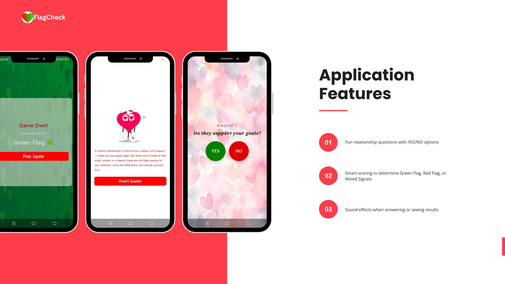
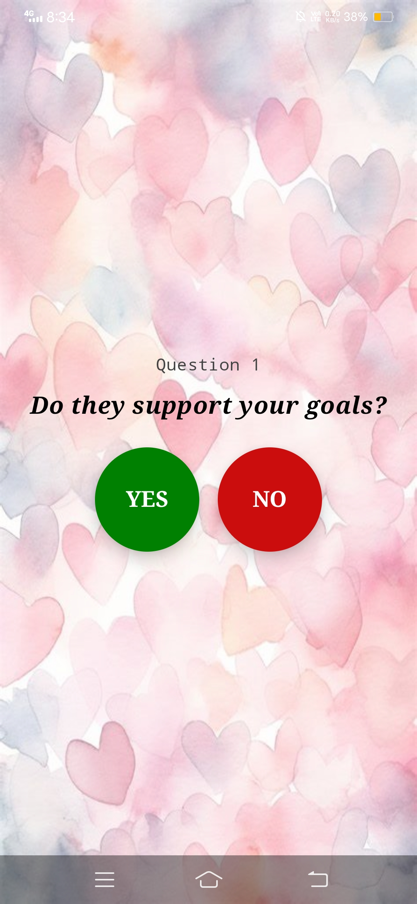
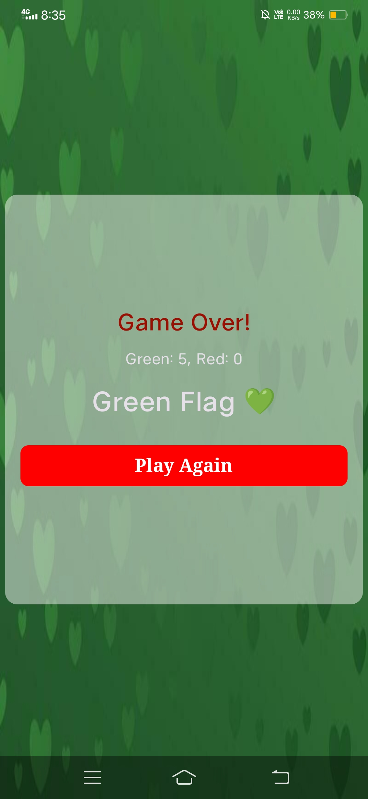

# ❤️ Green Flag or Red Flag – Relationship Quiz App

A fun and insightful quiz app to help users identify green or red flags in their relationships. Built using **Jetpack Compose**, **Hilt**, and **Kotlin**, this app offers a beautiful UI, background sound effects, and personalized quiz results.


---

## 🖼️ Screenshots

| Quiz Screen | Result Screen |
|-------------|---------------|
|  |  |

---

## ✨ Features

- 💚 Fun relationship questions with YES/NO options
- 🎵 Sound effects when answering or seeing results
- 📊 Smart scoring to determine Green Flag, Red Flag, or Mixed Signals
- 🎨 Beautiful background images based on results
- 🔁 "Play Again" feature to restart the quiz
- 🔊 Background music for immersive feedback

---

## 🚀 Built With

- [Jetpack Compose](https://developer.android.com/jetpack/compose) – Modern UI Toolkit
- [Hilt](https://developer.android.com/training/dependency-injection/hilt-android) – Dependency Injection
- [Kotlin](https://kotlinlang.org/) – Programming Language
- [MediaPlayer](https://developer.android.com/reference/android/media/MediaPlayer) – For playing sound effects


---

## 🎶 Sound & Assets

- Sound files stored in `res/raw/`
- Background images in `res/drawable/`

---

## 🔄 How It Works

1. The user answers questions using YES or NO buttons.
2. Each answer is scored — green for healthy, red for toxic.
3. At the end, a result is shown with matching theme and sound:
   - **Green Flag 💚** – Positive relationship signs
   - **Red Flag 🚩** – Warning signs
   - **Mixed Signals 🟡** – Balanced or unclear signs

---

## 📦 Installation

1. Clone the repository:

   ```bash
   git clone https://github.com/yourusername/green-red-flag-app.git

2. Open in Android Studio Arctic Fox or higher.

3. Connect a device or emulator.

4. Run the app.

📸 Demo Video
📺 Watch on YouTube

📲 Connect With Me
Instagram: [@yourhandle](https://www.instagram.com/trendroid_sujoy/)

YouTube: [Your Channel](https://www.youtube.com/channel/UCMbabIbEI-fT39aM5p5k2jA)

Email: sujoymaity526@gmail.com

⭐️ Show Some Love
If you found this project helpful or inspiring:

⭐️ Star this repo

📢 Share with your friends

🧠 Fork and build your own version
